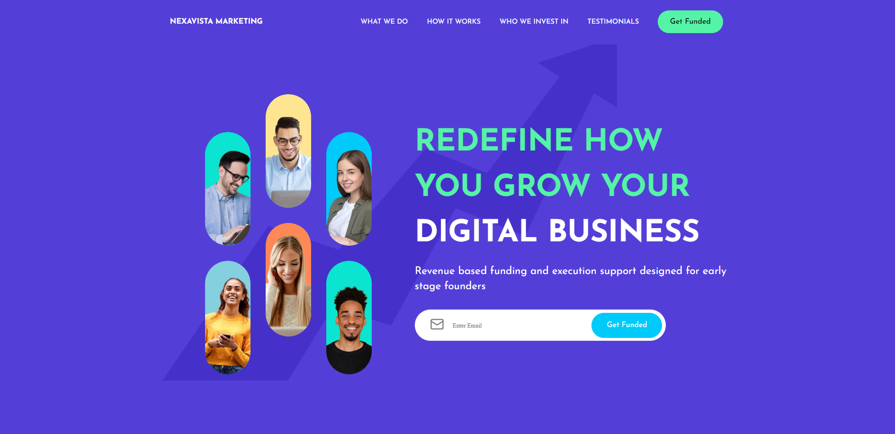

# Digital Business Website
### [Live Site](https://liamt-digital-business.vercel.app)

## Overview
Welcome to NEXAVISTA MARKETING, a sophisticated and responsive business website crafted using React and Next.js. In this project, my primary focus was on implementing best practices in React, designing an engaging UI with pure CSS, and incorporating advanced features to enhance my development skills.

## Features

- 🚀 Server-side rendering, SEO optimization, and enhanced speed.

- 🎨 Created with pure CSS to craft a visually appealing and professional design.

- 🎉 Smooth and captivating animations using the Framer Motion library.

- 🔄 Dynamic and responsive carousel component for showcasing key content.

- 📱 Seamlessly adapts to different devices and screen sizes.
